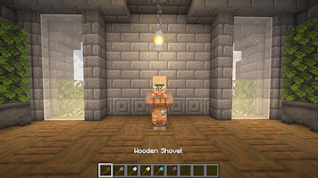

# Claim & Protect Villagers


Mayús + clic derecho con cualquier tipo de pala para reclamar un aldeano


## Los aldeanos reclamados:

* solo pueden ser recogidos por el propietario
* No pueden ser recogidos por las tolvas de aldeano.
* Los aldeanos reclamados / aldeanos zombis no recibirán daño (por defecto)

## Mayús + clic derecho para editar las propiedades de un aldeano reclamado:

* Cambia el bioma de tu aldeano reclamado
* Cerrar sus intercambios a otros jugadores
* Añadir/eliminar socios comerciales
* Anular la reclamación
* Recogerlos

<figure><figcaption>
Reclamar
</figcaption></figure>

<figure><figcaption>
Editar propiedades
</figcaption></figure>

